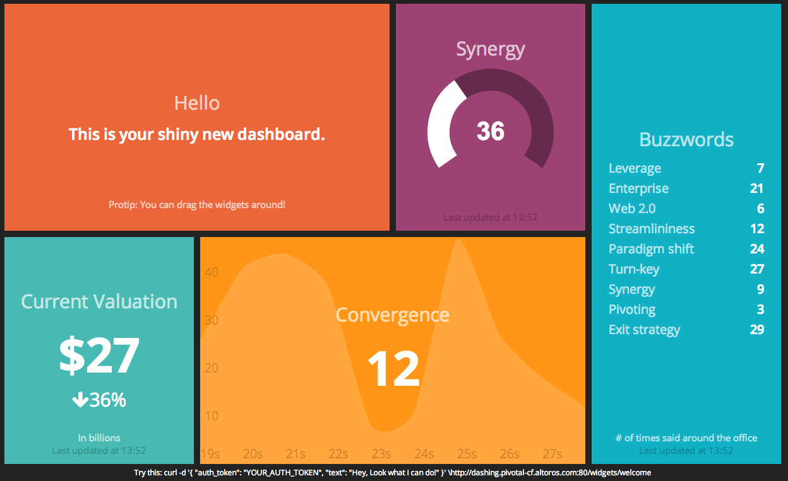

Deployment of Ruby Based Dashboard Application to a Cloud Foundry based PaaS
============================================================================

# Application Overview
[Dashing framework](http://shopify.github.io/dashing/) is a Sinatra based framework that allow to create build dashboards with flat styled widgets. This app contains some widgets including graph, meter, twitter and other vidgets. 



# Deploy to Cloud Foundry
You can use following command to deploy Dashing app to Cloud Foundry using [manifest](http://docs.cloudfoundry.org/devguide/deploy-apps/manifest.html) in this repo:
```
cf push
```
Or override options from manifest with following command:
```
cf push -p . -m 128M dashing
```

## Considerations

This application uses common Ruby stack and follows rules of [12factor](http://12factor.net/). Thereby it is very easy to deploy and scale this application in Cloud Foundry. 

For the twitter widget to work, you need to put in your twitter API keys in the [jobs/twitter.rb]() file.

## Questions and Answers
Feel free to leave your questions in issues of this project.
